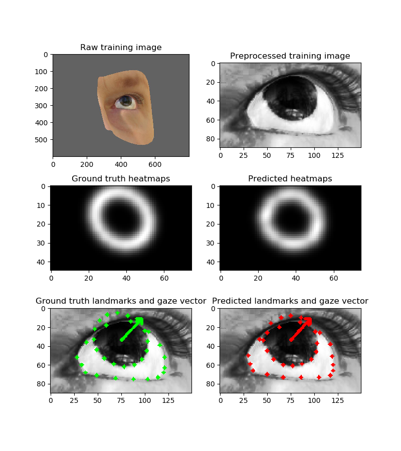

# Gaze Estimation with Deep Learning

This project implements a deep learning model to predict eye region landmarks and gaze direction.
The model is trained on a set of computer generated eye images synthesized with UnityEyes [1]. This work is heavily based on [2] but with some key modifications. 
This model achieves ~14% mean angular error on the MPIIGaze evaluation set after training on UnityEyes alone.

### Setup

NOTE: This repo has been tested only on Ubuntu 16.04 and MacOS. 

First, create a conda env for your system and activate it:
```bash
conda env create -f env-linux.yml
conda activate ge-linux
```

Then download the pretrained model files. One is for detecting face landmarks. The other is the main pytorch model.

```bash
./scripts/fetch_models.sh
```

Finally, run the webcam demo. You will likely need a GPU and have cuda 10.1 installed in order to get acceptable performance. 

```bash
python run_with_webcam.py
```

If you'd like to train the model yourself, please see the readme under `datasets/UnityEyes`.

### Materials and Methods

Over 100k training images were generated using UnityEyes [1]. These images are each labeled
 with a json metadata file. The labels provide eye region landmark positions in screenspace,
  the direction the eye is looking in camera space, and other pieces of information. A rectangular region around the eye was extracted from each raw traing image and normalized to have a width equal to the eye width (1.5 times the distance between eye corners). 
  For each preprocessed image, a set of heatmaps corresponding
  to 34 eye region landmarks was created. The model was trained to regress directly on the landmark locations and gaze direction in (pitch, yaw) form. The model was implemented in pytorch. The overall method is summarized in the following figure.


The model architecture is based on the stacked hourglass model [3]. The main modification was to add a separate pre-hourglass layer for predicting the gaze direction. The output of the additional layer is concatenated with the predicted eye-region landmarks before being passed to two fully connected layers. This way, the model can make use of the high-level landmark features for predicting the gaze direction. 

### Demo Video

[](https://drive.google.com/open?id=1WUUmd4quXq_YA5ANWDoUxqFGgguE_QJi)


### References

1. https://www.cl.cam.ac.uk/research/rainbow/projects/unityeyes/
2. https://github.com/swook/GazeML
3. https://github.com/princeton-vl/pytorch_stacked_hourglass
