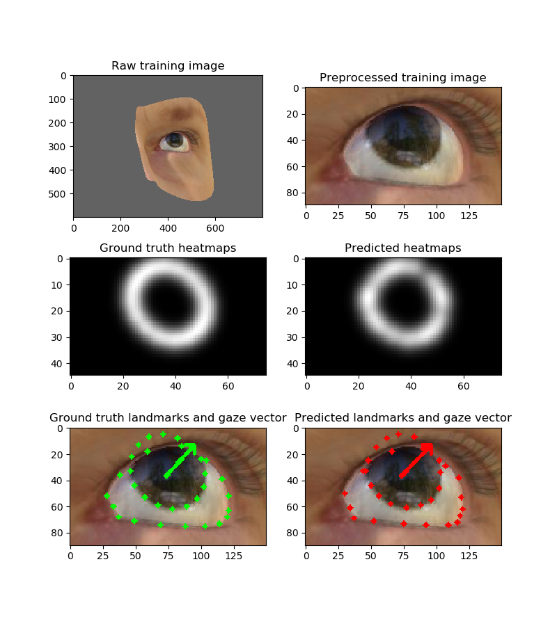

## Gaze estimation with deep learning

This project trains a deep learning model to detect eye region landmarks and predict the direction of gaze. 
It is implemented with pytorch. 

The overall method is summarized in the following figure.

